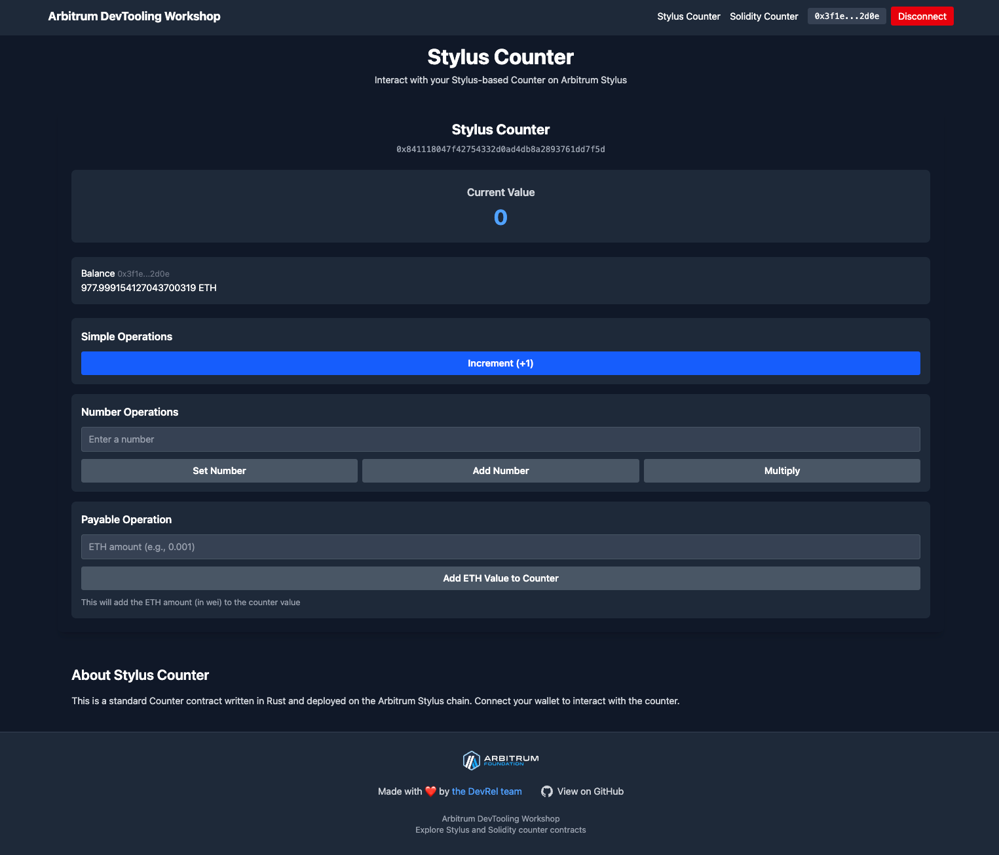

# 🛠️ Arbitrum Devtooling Workshop

<div align="center">
  
</div>

> [!NOTE]
> Learn the essentials of developer tooling on Arbitrum using both Solidity and Stylus (Rust), and connect them to a modern frontend. All in a preconfigured Codespace!

| Learning Outcomes |
|---|
| Understand the Arbitrum Nitro Devnode local environment |
| Deploy and interact with Stylus (Rust) and Solidity contracts |
| Use cargo stylus, foundry (forge/cast), and viem + wagmi |
| Connect contracts to a React + Vite + TypeScript frontend |
| Practice ABI export/import and contract method wiring |

## Quick Start (GitHub Codespaces)

Run the workshop in a preconfigured Codespace — no setup required!

[](https://codespaces.new/hummusonrails/arbitrum-devtooling-workshop)

**Steps:**
1. Click the button above.
2. Wait for initialization.
3. Open a terminal (Terminal → New Terminal).
4. Follow the workshop steps below.

## What You’ll Do

- ✅ Set up a local Arbitrum Nitro Devnode
- ✅ Deploy and interact with Stylus (Rust) and Solidity contracts
- ✅ Use cargo stylus, foundry (forge/cast), and viem + wagmi
- ✅ Connect contracts to a React + Vite + TypeScript frontend
- ✅ Practice ABI export/import and contract method wiring
- ✅ Experience with core Arbitrum developer tools

## Local Requirements (Skip if using Codespaces)

For running locally:
- [pnpm](https://pnpm.io/installation)
- [nvm](https://github.com/nvm-sh/nvm#installing-and-updating)
- [rust](https://rustup.rs/)
- [foundry](https://book.getfoundry.sh/getting-started/installation)
- [Docker](https://www.docker.com/products/docker-desktop/)
- [Nitro-devnode](https://github.com/OffchainLabs/nitro-devnode?tab=readme-ov-file#usage)

## Project Structure Overview

```bash
contracts/
├── contract-solidity/    # Solidity Counter contract
│   └── counter/          # Foundry project with src/, test/, etc.
└── contract-stylus/      # Stylus (Rust) Counter contract
    └── counter/          # Cargo project with src/, Cargo.toml, etc.
frontend/                 # React + Vite + TS frontend
nitro-devnode/            # Local Arbitrum node setup
scripts/
├── funds.sh              # Fund test accounts
└── package.json          # Script utilities
```

## Workshop Exercises

### Step 1: Install Dependencies

```bash
pnpm install -r
```

### Step 2: Start Local Arbitrum Node

> [!NOTE]
> Codespaces users: This is mostly handled for you, but you still need to manually start the devnode.

```bash
cd nitro-devnode
./run-dev-node.sh
```

### Step 3: Deploy Smart Contracts

#### Build & Deploy Stylus Counter Contract

* Stylus contract code is provided in `contracts/contract-stylus/counter/src/lib.rs`.
* Build and deploy locally:

```bash
pnpm --filter stylus-counter build
pnpm --filter stylus-counter deploy:local
```
* Copy the deployed contract address for later use.

#### Build & Deploy Solidity Counter Contract

* Solidity contract code is provided in `contracts/contract-solidity/counter/src/Counter.sol`.
* Build and deploy locally:

```bash
pnpm --filter solidity-counter build
pnpm --filter solidity-counter deploy:local
```
* Copy the deployed contract address for later use.

### Step 4: Export Stylus Contract ABI

* Use cargo stylus to export the ABI:

```bash
cd contracts/contract-stylus
cargo stylus export-abi --json > ../../frontend/src/abi/CounterStylus.json
```

* Open the exported ABI file and make sure it only includes the ABI in JSON format and no extra metadata.

### Step 5: Interact with Contracts Using Cast (Exercise)

> [!NOTE]
> **Exercise**: Explore the deployed contracts using cast commands!

* **Your Task**: Look at the contract source code in both `contracts/contract-solidity/counter/src/Counter.sol` and `contracts/contract-stylus/counter/src/lib.rs` to identify all available functions.

* **Example Command Format**:
  ```bash
  # Read functions (view/pure functions)
  cast call <CONTRACT_ADDRESS> "<FUNCTION_SIGNATURE>" --rpc-url http://localhost:8547 | cast --to-dec
  
  # Write functions (state-changing functions)
  cast send <CONTRACT_ADDRESS> "<FUNCTION_SIGNATURE>" <ARGS> --rpc-url http://localhost:8547 --private-key <PRIVATE_KEY>
  ```

* **Try These Interactions**:
  1. Read the current counter value
  2. Set the counter to a specific number
  3. Increment the counter
  4. Add a number to the counter
  5. Multiply the counter by a number

* **Example**:
  ```bash
  # Get the current number (replace with your contract address)
  cast call 0x8464135c8F25Da09e49BC8782676a84730C318bC "getNumber()" --rpc-url http://localhost:8547 | cast --to-dec
  ```

* **Hint**: Use the private key from the test accounts section below for write operations.

### Step 6: Connect Frontend to Contracts

* The frontend is in `frontend`.
* Update the config file (e.g., `frontend/src/config/contracts.ts`):

```ts
export const CONTRACT_ADDRESSES = {
  STYLUS_COUNTER: '0x...',
  SOLIDITY_COUNTER: '0x...',
} as const;
```

### Step 7: Frontend Development Workshop

> [!TIP]
> **Main Learning Focus**: The contracts are complete! Your task is to study and understand the frontend Web3 integration patterns using viem.

#### 📚 **Learning Objectives**
- Master viem library for blockchain interactions
- Understand wallet connection and state management
- Learn contract reading vs writing patterns
- Practice transaction handling and user feedback

#### 🔍 **Study These Guided Components**

The frontend contains educational comments and learning tasks:

**1. `frontend/src/contexts/Web3Context.tsx`** - Web3 Context & Wallet Connection
- 📝 **Task 1**: Study the Web3 context interface and client types
- 🔗 **Task 2**: Understand `publicClient` vs `walletClient` differences
- 🪝 **Task 3**: Learn custom hook patterns for Web3 state

**2. `frontend/src/components/Counter.tsx`** - Contract Interaction Patterns
- 📋 **Task 1**: Understand component props and TypeScript interfaces
- 🔗 **Task 2**: Study Web3 context integration
- 📊 **Task 3**: Learn state management for contract interaction
- 📖 **Task 4**: Master contract reading with `publicClient.readContract()`
- ✍️ **Task 5**: Master contract writing with `walletClient.writeContract()`
- 🎯 **Task 6**: Study different function handler patterns

**3. `frontend/src/components/ETHBalance.tsx`** - Balance Fetching & Formatting
- Learn how to fetch and display wallet balances
- Understand automatic refresh patterns

#### 🎯 **Key Learning Points**

**Contract Reading (No Wallet Required)**
```typescript
// Study this pattern in Counter.tsx
const result = await publicClient.readContract({
  address: contractAddress as `0x${string}`,
  abi,
  functionName: 'number',
  args: [],
});
```

**Contract Writing (Wallet Required)**
```typescript
// Study this pattern in Counter.tsx
const hash = await walletClient.writeContract({
  address: contractAddress as `0x${string}`,
  abi,
  functionName: 'increment',
  args: [],
  account: address as `0x${string}`,
});
```

**Transaction Confirmation**
```typescript
// Study this pattern for proper UX
await publicClient.waitForTransactionReceipt({ hash });
await fetchCounterValue(); // Refresh UI
```

#### 🚀 **Workshop Tasks**
1. **Explore the Code**: Read through the guided components and understand each TODO comment
2. **Test Interactions**: Use the UI to interact with both Stylus and Solidity contracts
3. **Compare Patterns**: Notice how the same frontend code works with both contract types
4. **Study Transactions**: Watch how transactions are handled from initiation to confirmation
5. **Understand Types**: See how TypeScript helps with Web3 development

### Step 8: Start the Frontend

```bash
pnpm --filter frontend dev
```

### Step 9: Test Accounts & Funding

**Deployer Account:**
* Address: `0x3f1Eae7D46d88F08fc2F8ed27FCb2AB183EB2d0E`
* Private Key: `0xb6b15c8cb491557369f3c7d2c287b053eb229daa9c22138887752191c9520659`

**Test Users:**

| Index  | Address | Private Key |
| ------------- | ------------- | ----------- |
| 0  | 0xf39Fd6e51aad88F6F4ce6aB8827279cffFb92266 | 0xac0974bec39a17e36ba4a6b4d238ff944bacb478cbed5efcae784d7bf4f2ff80 |
| 1  | 0x70997970C51812dc3A010C7d01b50e0d17dc79C8 | 0x59c6995e998f97a5a0044966f0945389dc9e86dae88c7a8412f4603b6b78690d |
| 2  | 0x3C44CdDdB6a900fa2b585dd299e03d12FA4293BC | 0x5de4111afa1a4b94908f83103eb1f1706367c2e68ca870fc3fb9a804cdab365a |
| 3  | 0x90F79bf6EB2c4f870365E785982E1f101E93b906 | 0x7c852118294e51e653712a81e05800f419141751be58f605c371e15141b007a6 |
| 4  | 0x15d34AAf54267DB7D7c367839AAf71A00a2C6A65 | 0x47e179ec197488593b187f80a00eb0da91f1b9d0b13f8733639f19c30a34926a |
| 5  | 0x9965507D1a55bcC2695C58ba16FB37d819B0A4dc | 0x8b3a350cf5c34c9194ca85829a2df0ec3153be0318b5e2d3348e872092edffba |
| 6  | 0x976EA74026E726554dB657fA54763abd0C3a0aa9 | 0x92db14e403b83dfe3df233f83dfa3a0d7096f21ca9b0d6d6b8d88b2b4ec1564e |
| 7  | 0x14dC79964da2C08b23698B3D3cc7Ca32193d9955 | 0x4bbbf85ce3377467afe5d46f804f221813b2bb87f24d81f60f1fcdbf7cbf4356 |
| 8  | 0x23618e81E3f5cdF7f54C3d65f7FBc0aBf5B21E8f | 0xdbda1821b80551c9d65939329250298aa3472ba22feea921c0cf5d620ea67b97 |
| 9  | 0xa0Ee7A142d267C1f36714E4a8F75612F20a79720 | 0x2a871d0798f97d79848a013d4936a73bf4cc922c825d33c1cf7073dff6d409c6 |

**Fund User Wallets:**

```bash
pnpm --filter scripts fund
```

### Step 10: Testing Contracts

```bash
pnpm --filter stylus-counter test
pnpm --filter solidity-counter test
```

## Network Settings

**Local Network:**
- Name: Localhost-Nitro
- RPC: http://localhost:8547
- Chain ID: 412346

**Codespaces RPC:**
- Use the forwarded port URL from the "Ports" tab (e.g., `https://your-codespace-8547.app.github.dev`)

## 🧑‍💻 Workshop Tips

- Use separate wallets for deployment and user interaction.
- Refer to the provided scripts and configs for examples.
- Ask questions and experiment with the tooling!

Happy hacking!
